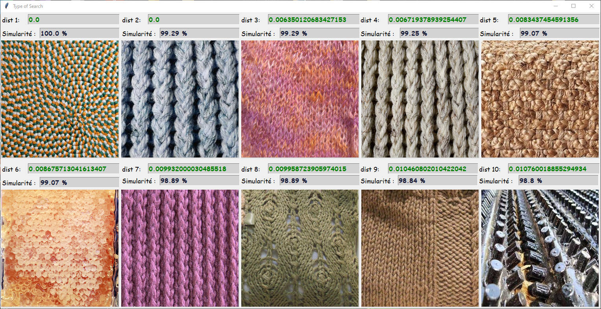

# CBIR System: Content-Based Image Retrieval

Welcome to the Content-Based Image Retrieval (CBIR) system repository! This project is designed to extract features from query images and retrieve similar ones from an image database.

## Introduction

In the field of computer vision, CBIR is a powerful technique that allows users to search for images based on their content rather than relying on metadata. This repository implements various image features for an effective CBIR system.

## Part 1: Feature Extraction

The system incorporates several popular image features categorized into color-based, shape-based, and texture-based features.

### Color-Based Features
1. **HSV Histogram:** Utilizes the Hue, Saturation, and Value components to represent color distributions.
2. **RGB Histogram:** Captures the frequency of occurrence of different color intensities in the Red, Green, and Blue channels.
3. **Average between RGB and HSV:** Combines features from both RGB and HSV color spaces for a comprehensive representation.

### Shape-Based Features
1. **Hu Moments:** Captures shape characteristics invariant to translation, rotation, and scale changes.
2. **Zernike Moments:** A set of orthogonal moments that provide robust shape descriptors.

### Texture-Based Features
1. **Haralick Texture:** Describes texture using statistical measures derived from the gray-level co-occurrence matrix.
2. **Local Binary Pattern (LBP):** Characterizes texture patterns based on the local structure of image neighborhoods.


## Part 2: Image Retrieval

The system returns the top 10 results for each method, measuring the percentage of similarity and calculating the distance. Here are some results of the system:

### Search by Color Result

**Image Query:**


**Result:**


### Search by Shape Result

**Image Query:**


**Result:**


### Search by Texture Result

**Image Query:**


**Result:**


### Hybrid Search Result

In this case, the user specifies the percentage of each type (color, texture, and shape).


Feel free to explore and experiment with different query images and parameters for a customized image retrieval experience!

If you have any questions or suggestions, please don't hesitate to open an issue or contribute to the project. Happy coding!


## Getting Started

To use the CBIR system, follow these steps:

1. Clone the repository:
   ```bash
   git clone https://github.com/ouomarabdessamade/Content-Based-Image-Retrieval.git
